# Two Winks a Charm
## _**Blockchain Customized for Z-Bank**_

In this homework, an ethereum testnet is created based on the proof-of-authority (PoA) consensus algorithm. 

## **Installments**

> [Geth 1.9.13 with Tools](https://geth.ethereum.org/downloads/)
> 
> [MyCrypto Wallet](https://mycrypto.com/)

## **Blockchain Mining**

### Step 1: Create a folder called _**twinkle**_ with Geth package
* One option is to use terminal and type:
    ```
    mkdir twinkle
    ```

_Tip: You may call it anything you like._

### Step 2: Generate two new nodes using
* Open terminal or bash window 
* Move to _**twinkle**_ folder
* type command line prompts:
    ```
    ./geth account new --datadir node1
    ./geth account new --datadir node2
    ```
    * _For simplicity, passwords for all nodes are synchronized to the same password_
* Copy the address and secret keys onto a text file


### Step 3: Launch a new blockchain testnet
* Under _**twinkle**_ folder, enter the following in the terminal window:
    ```
    ./puppeth
    ```
* Enter _**winkweb**_ as the name for the blockchain testnet. Again, you can choose any name you want!
* Choose `2` for `Configure new genesis`:

    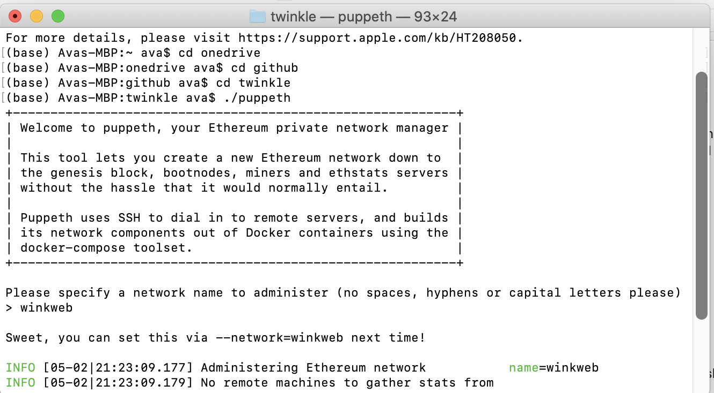

* `Create new genesis from scratch` by typing `1`
* For consensus structure, type in `2` to choose `Clique - proof-of-authority`
* Enter the public addresses of the two nodes starting with `0x` one at a time for authorized accounts to seal ethereum blocks
* For Pre-funded accounts, copy and paste the two addresses again
* Enter `no` instead of funding with 1 wei
* The block time is set at the default time of `15s` by hitting enter
* Type in a 3-digit chain ID for MyCrypto testnet connection. It is is 357 for _**winkweb**_

### Step 4: Export Network Confuration
* Go back to the `./puppeth` terminal window 
* Select `2. Manage exising genesis` option
* Choose `2` to `Export genesis configurations`
* Hit enter to generate files in the same _**twinkle**_ folder by default:
    * _View at the terminal window:_
    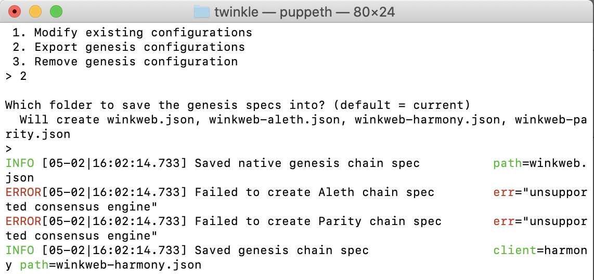

    * _Folder overview:_
    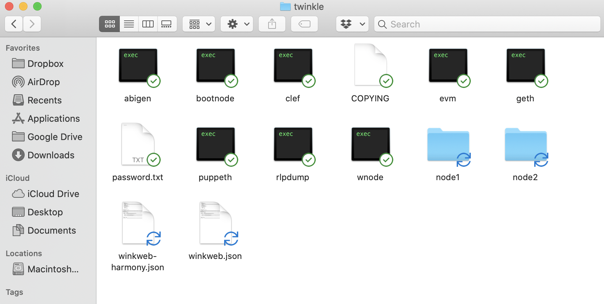


### Step 5: Initialize Nodes

* Under _**twinkle**_ folder, in a terminal window:
    ```
    ./geth init winkweb.json --datadir node1
    ./geth init winkweb.json --datadir node2
    ```
    * `--datadir` flag leads to the data directory for keystore and databases

### Step 6: Create a password test file

* Create a text file called `password.txt` in _**twinkle**_ folder
    
    ```
    secret password of your own choice
    ```
### Step 7: Mining

* Launch Node 1

    ```
    ./geth --datadir node1 --rpc --mine --minerthreads 1 --unlock "0xC49ef9067a3D523E313FCB1aAE78340ef887B83e"  --password password.txt --allow-insecure-unlock
    ```
    * `--mine` flag allows for mining
    * `--minerthreads 1` tells the computer to use 1 CPU
    * `--rpc` flag allows MyCrypto wallet to talk to our chain
    * `--unlock` unlocks node 1 address using passwod text file
    * `--allow-insecure-unlock` resolves the http issue 
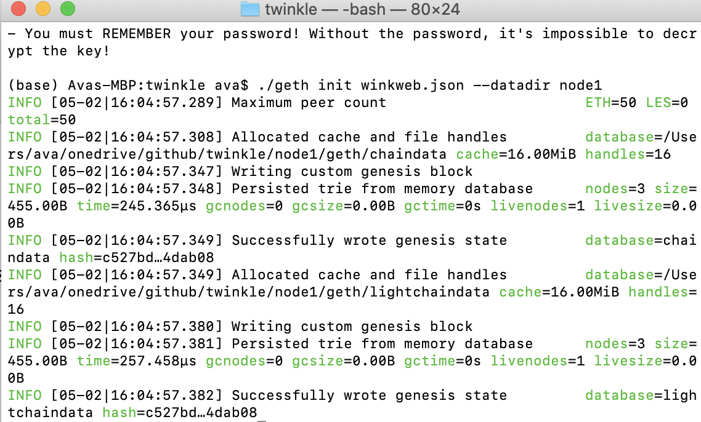
* Copy and paste the `enode:` address onto notes for node 2 mining
   
* Launch Node 2

    ```
    ./geth --datadir node2 --port 30304 --mine --unlock "0x7B1051942e452b3288564F0fB594E8978077c676" --password password.txt --bootnodes "enode://d06b72dc40419de3e48ee07a66376f95563d1061f7a7aca9158e6ad73d1d5d2caddb9a5662f24d4dc66c13b35b0c5f17ffc4c4e5d2b978952b2b3a883d9f4fc0@127.0.0.1:30303"
    ```
    * `--port` flag tells the computer which port to start mining.
    * `--bootnodes` flag allows both nodes to be connected by passing on information of P2P discovery bootstrap from comma separated enode URLs
        * The default port is `30303` that is used by node 1
    * _Note: `--ipcdisable` needs to be added on windows to disable IPC-RPC server and allow mining on multiple mining processes to run parallel_

_Launching_ 
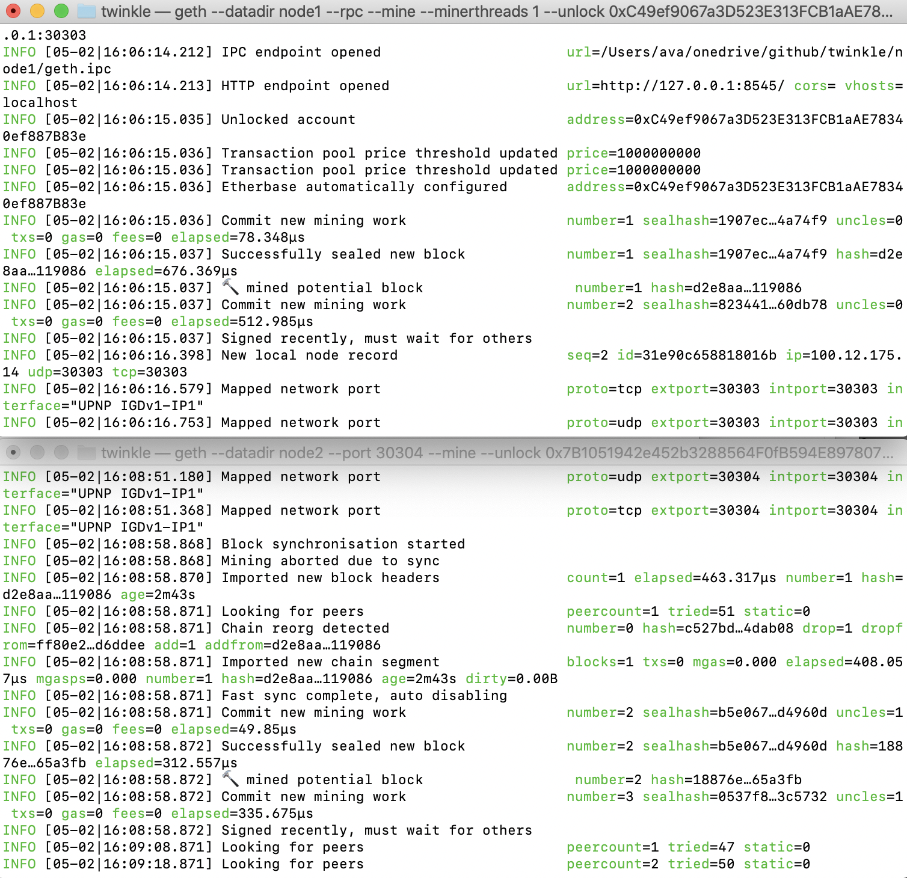

_Block Seal_
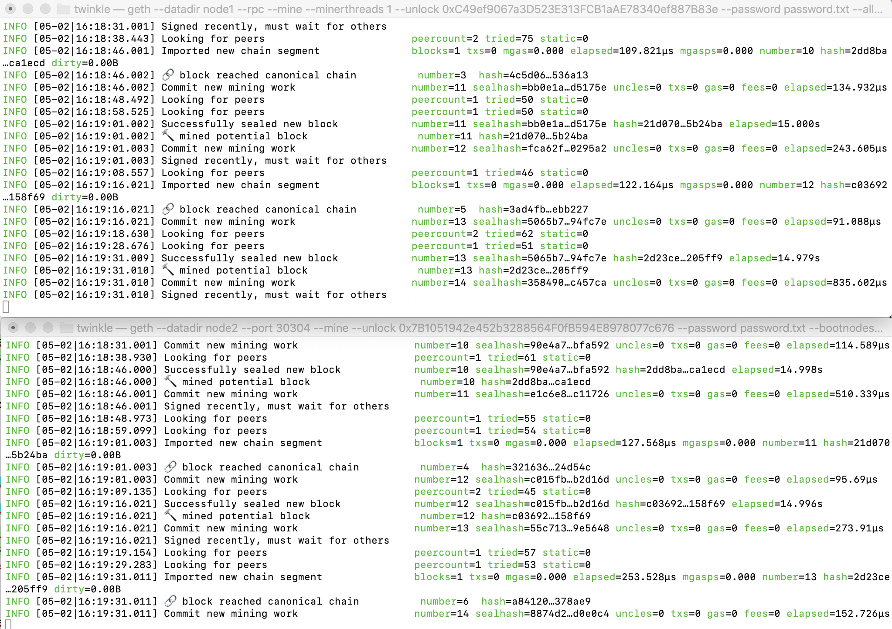
<details></summary>
Blocksealing continues:
</summary>

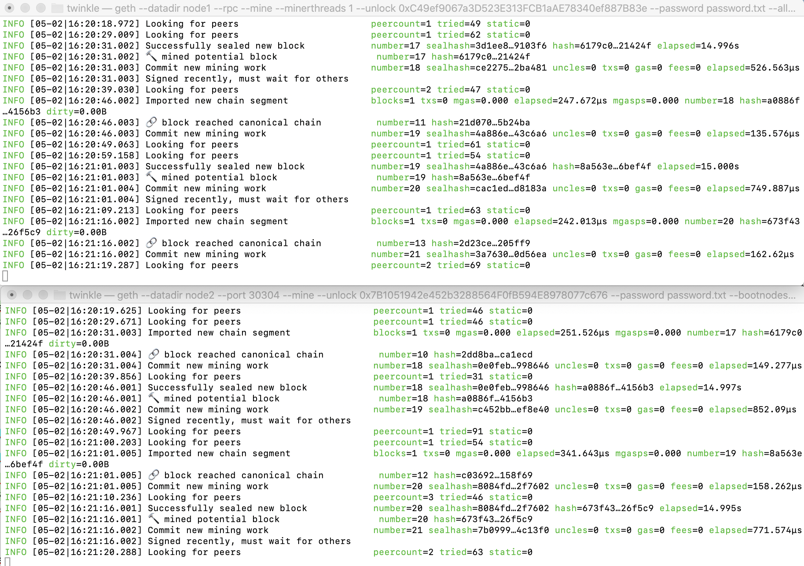

</details>

## **Connect to MyCrypto Wallet**

### Step 1: Unlock the account on MyCrypto Wallet by uploading the file under `keystore` subfolder inside `node1` folder with the password.

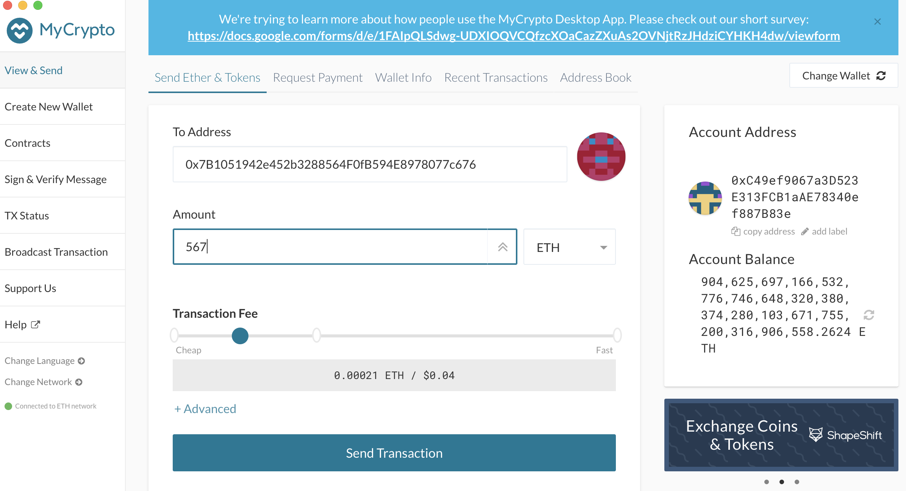

### Step 2: Change Network on the bottom left-hand-side corner and input as follows:
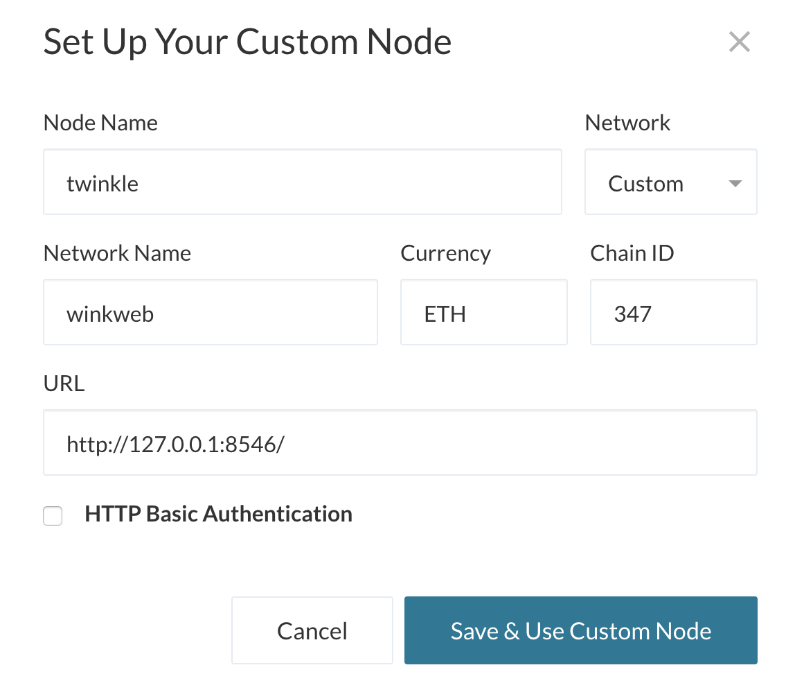
_Note: Chain ID is set to be 357. The default URL is http://127.0.0.1:8545/._


## **MyCrypto Transactions**

### Step 1: Click on _**View & Send**_ on the top left-hand-side corner below MyCrypto Icon, enter node2 address as the recipient, confirm the amount and transaction fee.

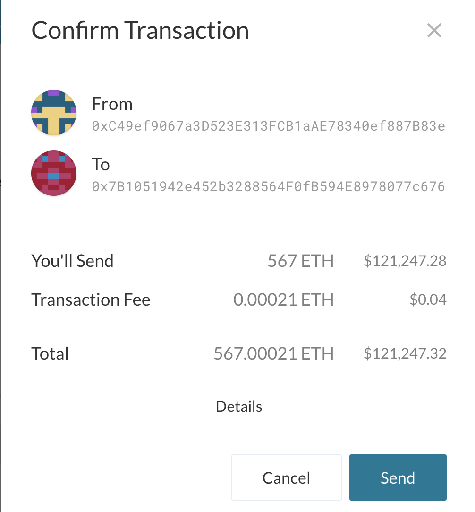

### Step 2: Check status by entering the transaction hash.

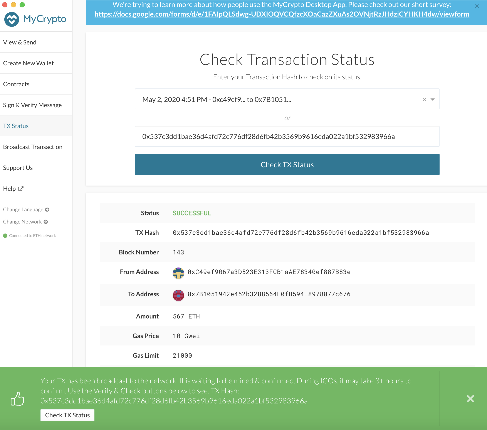

_**High five!**_


## Challenge

To add another bootnode onto _**twinkle**_ network to connect all three for a new colleague, we use port `30305` and connect node3 to node1 by:
<details><summary>
Step 1: Create a new node, node3</summary>
```
./geth account new --datadir node3
```
</details>

<details><summary>
Step 2: Initialize node3</summary>
```
./geth init winkweb.json --datadir node3
```
</details>

<details><summary>
Step 3: Launch node3 mining</summary>
```
./geth --datadir node3 --port 30305 --mine --unlock "0x1c3a8EcC422ea95aFbe09E8c0e0553f7f163B830" --password password.txt --bootnodes "enode://d06b72dc40419de3e48ee07a66376f95563d1061f7a7aca9158e6ad73d1d5d2caddb9a5662f24d4dc66c13b35b0c5f17ffc4c4e5d2b978952b2b3a883d9f4fc0@127.0.0.1:30303"
```
</details>

However, an error for "unauthorized signer" was preventing the mining:
<details><summary>
Details on warning message "Block sealing failed":</summary>

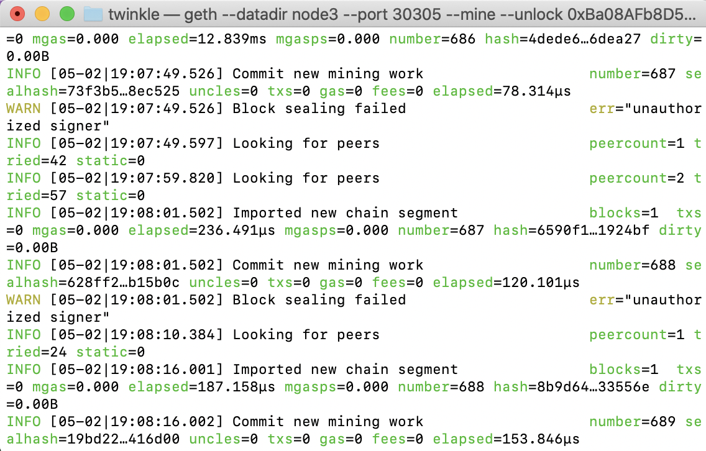
</details>

<details><summary>
The following attempt was made to change the blockchain network settings via `puppeth`. However, mining did not occur. See details below:</summary>

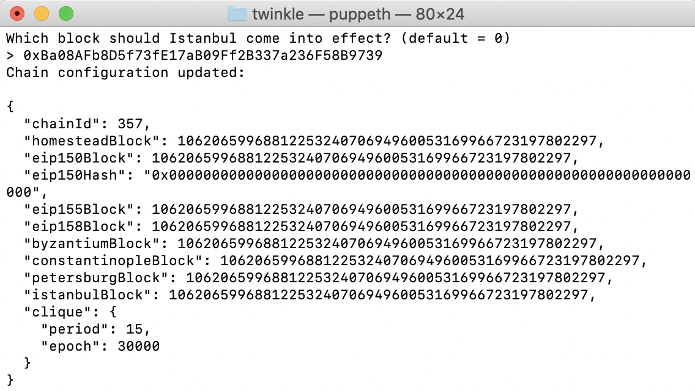
</details>

In order to clear up the preceding processes, the following command line prompt was entered under the same folder:
```
rm -Rf node1/geth node2/geth node3/geth
```

A new folder _**twinkles**_ was created with three nodes as authorized sealers and their addresses to be pre-funded under `./puppeth`. The three nodes are running on port `30303`, `30304` and `30305` respectively. The three nodes were initialized as follows:
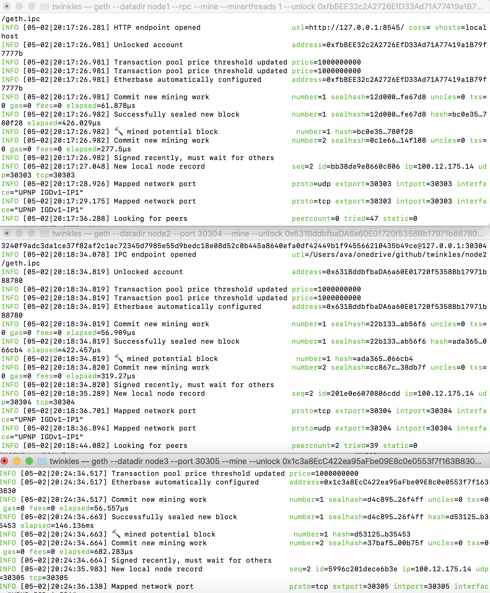

The three nodes start talking to each other! 
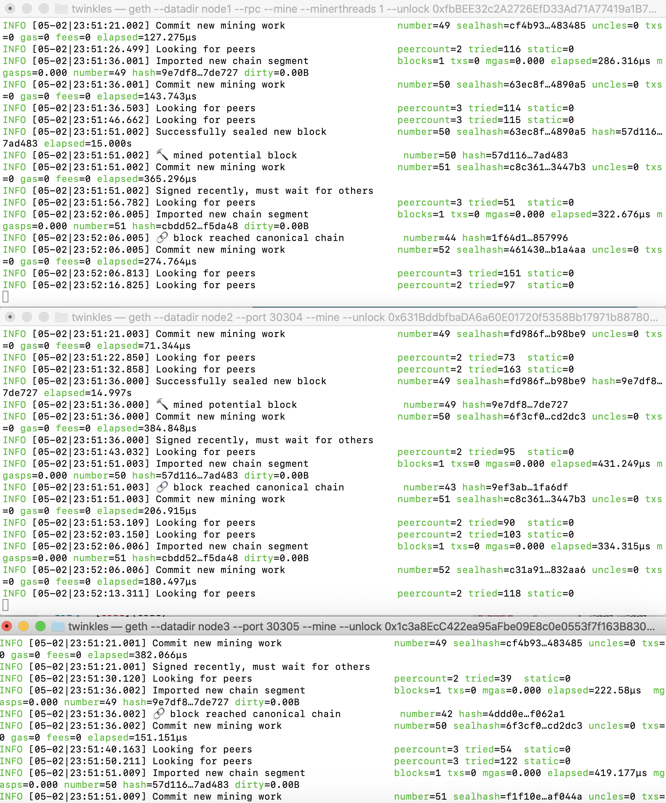
_Note: The folder for `node3` is based on node3 created under _**twinkles**_ folder for proof-of-authority blockchain testnet _**winksplus**_._ For details, please refer to logs in [Nodes](Code/nodes_twinkles) folder.

_**Cheers!**_

--- 
## Files
[Code](Code)

[Nodes](Code/nodes_twinkles)

[Images](Screenshots)

# References:

* CU Gitlab Repository
* https://github.com/ethereum/go-ethereum/wiki/Command-Line-Options
* https://ethereum.stackexchange.com/questions/23664/how-to-generate-the-correct-go-ethereum-bootnode-when-creating-a-private-blockch
* https://github.com/ethereum/go-ethereum/blob/master/README.md
* https://hackernoon.com/setup-your-own-private-proof-of-authority-ethereum-network-with-geth-9a0a3750cda8
* https://medium.com/0xcert/https-medium-com-0xcert-framework-tutorial-1-how-to-run-and-prepare-geth-node-for-back-end-integration-df33520949e3
* https://medium.com/@collin.cusce/using-puppeth-to-manually-create-an-ethereum-proof-of-authority-clique-network-on-aws-ae0d7c906cce
* https://ethereum.stackexchange.com/questions/125/how-do-i-set-up-a-private-ethereum-network
* https://blog.ethereum.org/2017/04/14/geth-1-6-puppeth-master/


